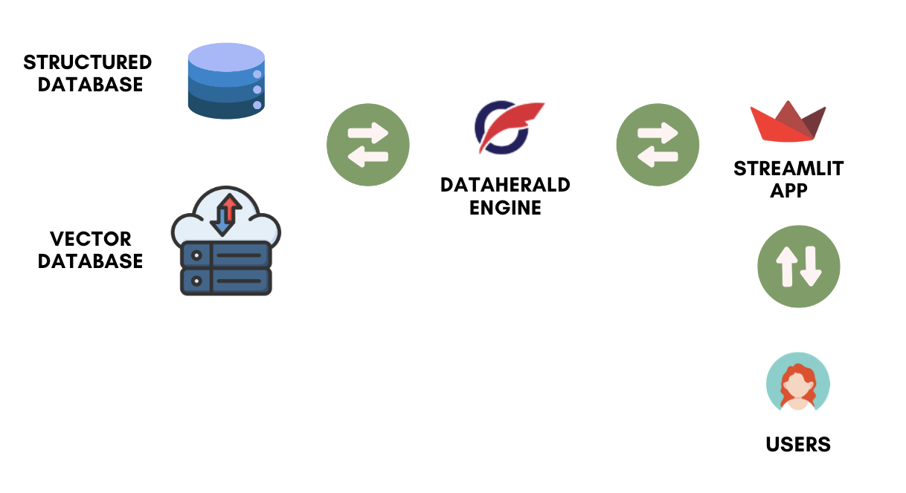

# Dataherald Community App 🛠️

Welcome to the Dataherald Community App! This Streamlit-based web application allows users to interact with the Dataherald engine through a user-friendly interface, making it easier to work with your structured data. 🔥🔥🔥


## Table of Contents 📚

- [Features](#features) 🚀
- [Prerequisites](#prerequisites) ⚙️
- [Installation](#installation) 🚀
- [Usage](#usage) 📈
- [How it works?](#how) 🧐
- [Contributions](#contribution) 🤝


## Features 🚀

- **Ask your Questions:** 💡 Connect to various databases by providing their connection details and ask any questions that have on top of your mind from Dataherald's powerful NL-to-SQL engine.

- **Add Golden records:** 💎 In order to boost the performance of the engine even higher, add verified Question/SQL pairs. These pairs are going to be used by the agent at inference time.

- **View and Remove Golden records:** 📜 This application provides a user-friendly interface for viewing, searching, and removing Question/SQL pairs to control the agent's behavior.

- **Table Scanning:** 🗃️ Scan tables in connected databases by specifying the table name. Scanned tables are used by the agent to generate answers.

- **Viewing Tables:** 📊 View descriptions and details of tables within connected databases. Understand the structure and number of columns of each table easily.

## Prerequisites ⚙️

Before running Dataherald, ensure that you have the following prerequisites:

- **Dataherald engine:** 💻 Make sure you have Dataherald engine running since this application calls the endpoints provided by the Dataherald engine.

- **Python 3.x:** 🐍 Make sure you have Python 3.x installed on your system. You can download it from the [official Python website](https://www.python.org/downloads/).

## Installation 🚀

To get started with Dataherald, follow these steps:

1. **Clone the repository to your local machine:**

   ```shell
   git clone https://github.com/Dataherald/streamlit-app.git
   cd streamlit-app

2. **Create a virtual environment (optional but recommended):**

    ```shell
    python -m venv venv
    source venv/bin/activate  # On Windows, use `venv\Scripts\activate`
    ```

3. **Install required packages: 📦 This app relies on several Python packages. Install them by running the following command within the project directory:**

    ```shell
    pip install -r requirements.txt
    ```

## Usage 📈
To use Dataherald Community App and interact with databases, follow these steps:

Start the Dataherald Community App application:

``` shell
streamlit run 🏠_Home.py
```

## How it Works 🧐
If you want to know how the app works, you can take a look at the following figure:



## Contributions 🤝
We are extremely open to contributions, be it through new features, new pages, or improved documentation.

We are currently developing this repository, you can take a look at the roadmap we have for this app, and we will appreciate your contribution for the future works that we have. You can find the roadmap [here](https://github.com/Dataherald/streamlit-app/blob/main/contributions.md#roadmap-%EF%B8%8F).
